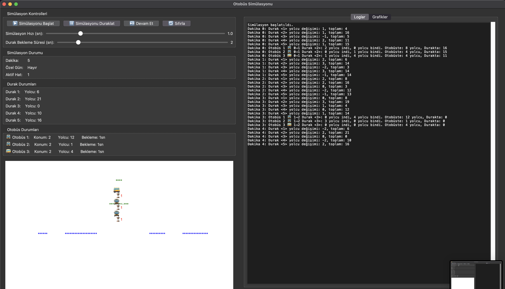
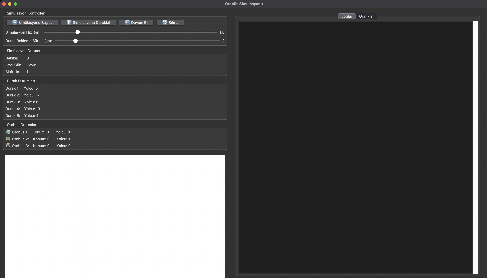
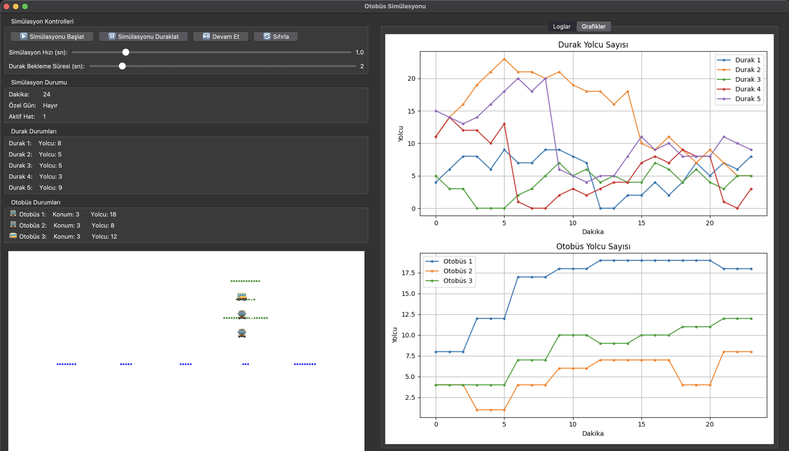

# 🚌 Public Transport Decision Support System

> A Python-based simulation and decision support system designed to improve operational efficiency in urban public transportation.


---

# 📖 About

The **Public Transport Decision Support System** is a Python-based simulation platform developed to model passenger movements, bus operations, and decision-making processes within an urban public transportation network.

The application continuously monitors passenger density at bus stops, vehicle occupancy, and operational conditions to generate recommendations that help improve transportation efficiency.

Instead of being only a transportation simulator, this project focuses on **decision support algorithms** that assist operators in making operational decisions.

---

# ✨ Features

- 🚍 Multi-bus fleet simulation
- 👥 Passenger boarding and alighting
- ♿ Disabled passenger support
- 📍 Bus stop passenger monitoring
- 📊 Capacity analysis
- 📝 Real-time logging
- 📈 Live statistics and charts
- 🎛 Interactive GUI
- ⚙ Adjustable simulation speed
- 🚦 Operational decision support

---

# 🧠 Decision Support Capabilities

The system analyzes current transportation conditions and can support decisions such as:

- Increase service frequency
- Dispatch additional buses
- Accelerate following vehicles
- Detect overloaded buses
- Monitor station congestion
- Improve passenger flow
- Reduce waiting times

---

# 📸 Application Preview

## Main Interface



The main interface allows users to control the simulation, monitor bus locations, passenger counts, and simulation parameters in real time.

---

## Running Simulation



During execution, the system updates bus positions, passenger movements, and operational logs while visualizing the transportation network.

---

## Statistics & Analytics



Passenger statistics and vehicle occupancy are visualized dynamically using graphical analysis.

---

# 🛠 Technologies

- Python
- Tkinter
- Matplotlib
- Object-Oriented Programming (OOP)
- Logging
- Event-driven Programming

---

# 📂 Project Structure

```text
Public-Transport-Decision-Support-System
│
├── src/
│   ├── main.py
│   ├── simulation_core.py
│   ├── simulation_gui.py
│   ├── simulation_menu.py
│   ├── graphics.py
│   └── logging.py
│
├── screenshots/
│   ├── app1.png
│   ├── app2.png
│   └── app3.png
│
├── logs/
│
├── requirements.txt
├── setup.py
├── create_exe.bat
├── Otobus_Simulasyonu.spec
├── README.md
├── LICENSE
└── .gitignore
```

---

# ⚙ Installation

Clone the repository

```bash
git clone https://github.com/USERNAME/Public-Transport-Decision-Support-System.git
```

Go to project directory

```bash
cd Public-Transport-Decision-Support-System
```

Install dependencies

```bash
pip install -r requirements.txt
```

Run the application

```bash
python src/main.py
```

---

# 🚀 Future Improvements

- AI-assisted decision support
- Traffic congestion simulation
- GPS integration
- Database support
- Multi-route management
- Passenger demand prediction
- Fleet optimization algorithms
- Historical data analysis
- Web dashboard
- Multi-city transportation support

---

# 🎓 Educational Objectives

This project was developed to improve knowledge and practical experience in:

- Public Transportation Systems
- Decision Support Systems (DSS)
- Simulation Algorithms
- Python Application Development
- Object-Oriented Programming
- Data Visualization
- GUI Design

---

# 📄 License

This project is licensed under the MIT License.

See the LICENSE file for additional information.